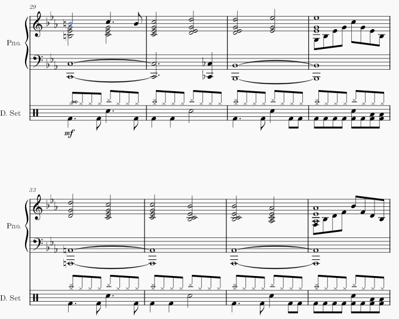

# Using 'Voices' in Musescore

[Musescore](https://musescore.org/en/node/355624) is a free desktop application for composing and arranging sheet music. One key feature that needs to be present in sheet music is the ability to have multiple notes overlapping one the same staff. There are two main ways to do this. One such way is a "double stop", which is the term for playing two (or potentially more) notes at once on an orchestral string instrument. This is very easy to do in Musescore, done by simply clicking with the note addition tool in the same horizontal but different vertical range as another, already present note. However, this is not quite what I'm looking for, as it means that the rhythm for the notes will be the same. So instead, Musescore provides voices.

The term "voices" likely comes from choral music, in which the choir is divided into different ranges that are singing different notes in a chord. However, these voices will often have slight variations in rhythm. Voices are an option that are, by default, in the main toolbar. As shown in Musescore 4:

Voices are essentially entirely seperate parts that just share the same instrument and staff. This does mean that they can get a bit cluttered, but it's the arranger's job to make sure that isn't the case. This is an example of voices being used:

In the 4th and 8th shown measures, there are two voices in the upper staff of the piano. While voice 1 is holding a chord, voice 2 is playing a sequence of eighth notes (a duration of note in which there are 8 notes in a measure). A more subtle use is in the 1st shown measure, where a eighth note that leads in to the next measure stands alone rhythmically, meaning that the best way to represent it is to have the top note of each quadruple stop be moved into a seperate voice, along with the eighth note. A perhaps less obvious example in the same image is the drum part. The hi-hats and cymbals (which have an 'x' notehead) are one voice, while the kick, snare, and toms (which have a round notehead) are in a seperate voice.

My first time using voices was in Musescore 3, but the process is still identical. I'm looking to add a third part to an arrangement of a song, and a piano only has two staves. I select the 'Voice 2' option, and the note on my cursor turns green rather than blue:

However, after I start placing notes, it starts looking extremely messy. The note staves are going to wrong way, and the rest in voice 2 is placed underneath voice 1, despite voice 2's notes being above:

Little did I know, voice 2 is meant to be used for bass parts, like a drumset's kick drum, where the notes would be underneath any other notes present on the staff. However, Musescore's flexible voicing system is lacking any sort of **constraints** (usage factors that make it inconvient to attempt using in a way that it was not intended to) that would indicate this to the user. Now that I have more experience I know that there are still ways to proceed from this point, such as manually editing the staff direction. However, at the time, I came up with a different strategy. I would simply move my currently written part to voice 2 and add the new one using voice 1. Thankfully, Musescore provdes good **error correction** by providing undo and redo buttons, as well as shortcuts for those buttons via the common **conventions** (established practices or norms) of *ctrl-V* and *ctrl-shift-V*, respectively.

After selecting all of the notes (by clicking on the first note and then shift-clicking on the last note), I notice that the voice 1 button is currently highlighted. So, I try clicking on the voice 2 button, and...

Well, I guess that's what I wanted. The notes have been transferred to voice 2, but in their place they left rests in the same position, making it a bit harder to add the new part. There seems to be a disconnect between my **mental model** and the **conceptual model** of this interaction. The conceptual model is that each note can individually be moved between voices, so naturally they should leave a rest of the same duration in their place. However, my mental model is that because I had block-selected a large portion of notes, that it would follow the same procedure as pressing the delete button would: that Musescore would will in the deleted section with the largest possible rests.
